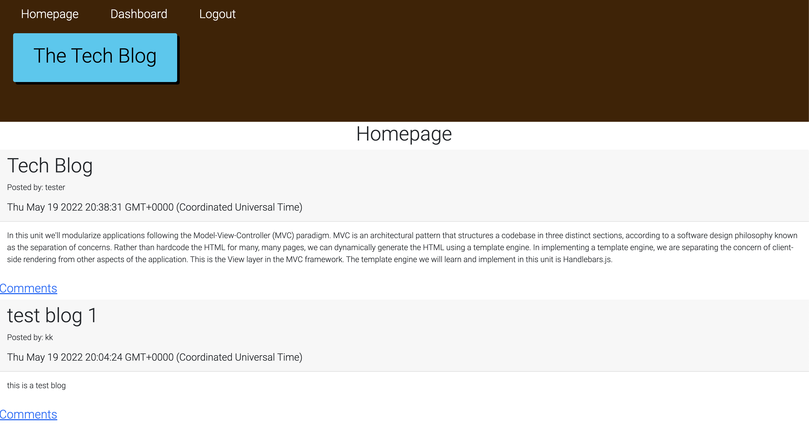

## Tech Blog
By: Kai Walsh

## Description
Created a CMS-style blog where developers can publish their blog posts and comment on other developers' posts, too. This app is built from scratch and deployed on Heroku. It uses Handlebars.js as the templating language, Sequelize as the ORM, and express-session npm package for authentification. 

## User Story
AS A developer who writes about tech
I WANT a CMS-style blog site
SO THAT I can publish articles, blog posts, and my thoughts and opinions

## Table of Contents
- [Installation](#Installation)
- [Usage](#Usage)
- [Credits](#Credits)
- [Questions](#Questions)

## Installation
This app uses express, express-session, connect-session-sequelize, express-handlebars, handlebars, bcrypt, dotenv, MySQL2, and sequelize packages.

`npm i`

Add environmental variables by creating a .env file
`
DB_NAME=tech_db
DB_USER=root
DB_PASSWORD=password
SESSION_SECRET={your-session-secret}
`

## Usage
Add blog posts and comments to a tech blog.

## Credits
HandlebarTodos and class videos, help from CJ Sanders and Kirtley Adams, referenced our group project famYOUly.

## Deployment
https://tech-blog-hw123.herokuapp.com/

## Questions
GitHub: kaiwalsh1

Contact Me: kai@kaiconsulting.co